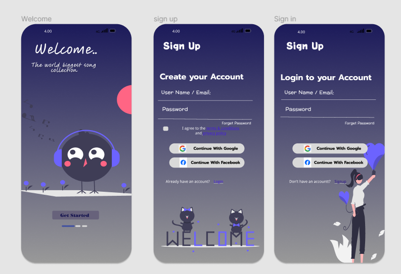

# Codesoft-UI-UX
# TASK 01:  Mobile App Signup Flow

A mobile app signup flow is the process of users creating an account and signing up for an
 app. The goal of a good signup flow is to make it easy and quick for users to sign up, while
 also collecting the necessary information from them
### Image Preview

  # TASK 03:  Restaurant menu
   A restaurant menu UI/UX project is the process of designing a menu that is
 both visually appealing and easy to use. The goal of a good restaurant menu
 is to make it easy for customers to find the dishes they want, and to
 encourage them to order more.
### Image Preview
)
 
